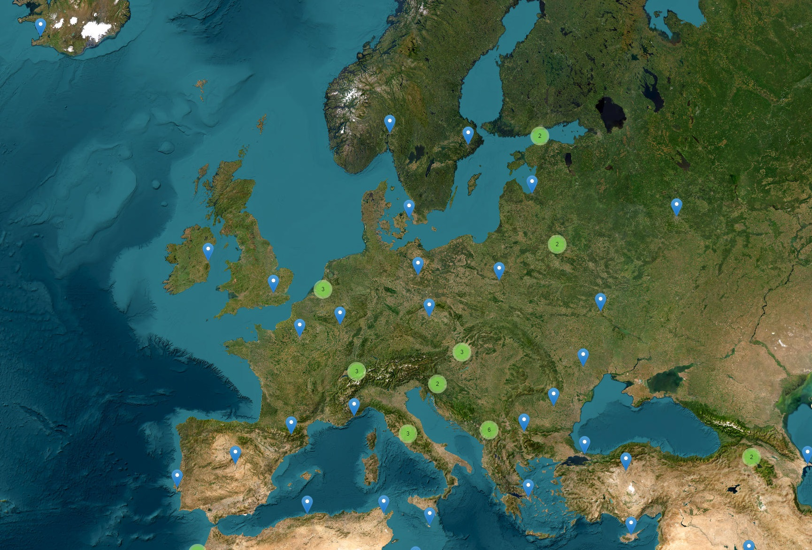
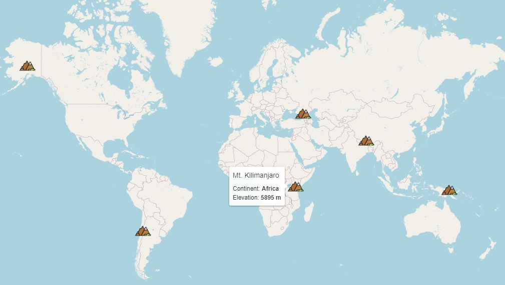
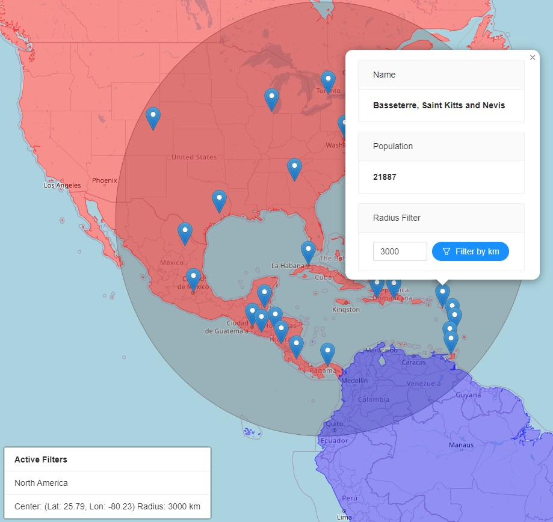

# Introduction
This repository contains the completed code for my React Leaflet course on Udemy. I have deprecated the course because it is out of date. However, below is a list of course content, some screenshots of the completed application and instructions of how to start the application locally.

# What is included?
* Creating a React application with create-react-app
* Setting up React Leaflet with create-react-app
* Initialising a React Leaflet map
* Configuring tile layers
* Where to find sample spatial data and tile servers
* Tools to generate your own sample spatial data for development purposes
* What is GeoJSON?
* React Leaflet hooks
* Filtering points within a radius
* Filtering point by clicking on a polygon
* How Leaflet looks in the DOM
* Adding markers
* Implementation of third party layers from plugins
* Marker clustering
* Centering the map to a clicked position
* Adding custom Icons (how to implement font-awesome icons on React Leaflet)
* Adding and customising popups
* Adding and customising tooltips
* How to customise React Leaflet popups with any React UI library
* Adding Polygon layers
* What is a layer in React Leaflet terms
* How to filter points based on Polygon clicks (using Turf.js)
* Adding a layer control
* Building your own custom controls
* Showing Geospatial information from a different Coordinate Reference System on React Leaflet map
* Asynchronous calls and updating React Leaflet components
* Adding third-party Leaflet controls to a React Leaflet application
* Leaflet Routing Machine

# How it looks
## Marker Clustering
Example of European cities rendered on a WMS Tile Layer using the popular Marker Clustering library

## Custom Marker and Tooltip
Example of the creation of a custom mountain map marker and integration into a React Leaflet map, included is a tooltip displaying custom information about the feature

## Polygon and Radius Filtering
Example of using React Leaflet to implement radius and polygon filtering. The popup includes information about each city, and the option to filter other cities based on a user specified radius in km.

The circle shows an active radius filter, while the North American continent is red, indicating that it is being filtered. Each of these filters are displayed in a React Leaflet custom control in the bottom left corner

# Starting the application
Ensure you have nodejs installed on your machine. `node -v` should display a version number, e.g. `v18.12.0`

* Clone the repository
* Navigate to the root directory of the repository
* `npm i` - to install node dependencies
* `npm start` - to start the application
* Navigate to `http://localhost:3000` to view